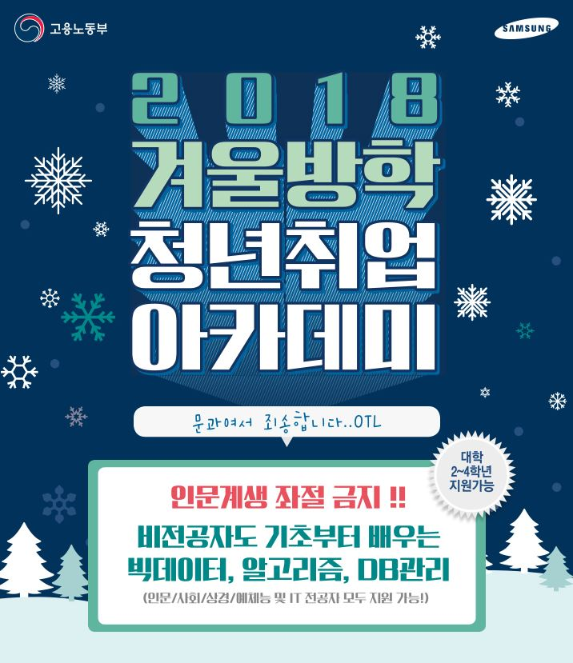

# 18/19년 겨울 삼성 멀티캠퍼스 프로젝트

본 레포지토리는 삼성 멀티캠퍼스에서 18/19년 진행됐던 프로젝트입니다.

---

## 진행 기간
### 2019.01.25 ~ 2019.01.31 ( 5일간 ) 
- 1일차 : 프로젝트 설계
- 2일차 : 프로젝트 개발
- 3일차 : 프로젝트 개발
- 4일차 : 테스트 디버깅
- 5일차 : 테스트 디버깅 및 발표

---

## 조원 소개 및 역할
- 강도형 : 공공API를 통해서 받은 데이터 전처리
- 조은 : 공공API를 통해서 받은 데이터 분석
- 성민석 : 분석된 데이터를 데이터베이스에 입력
- 고종윤 : 데이터를 보여줄 웹프로그래밍 개발

---

## 프로젝트 내용
사용자가 섭취한 음식을 검색하거나 사용자로부터 입력된 누적 데이터를 통해서 특정 기간동안 부족한 영양성분을 찾아주는 프로젝트를 진행하였습니다.

---

## 사용된 데이터
**식품안전나라 홈페이지**(www.foodsafetykorea.go.kr)를 통해서 **식품영양성분 DB**를 다운로드하여 약 13,000개의 데이터를 전처리 후 사용가능하게 가공하였습니다.

---

## 자료 구성
- Web Programming
    - static
        - data
        - dist
        - images
        - js
        - less
        - pages
        - vendor
    - templates
        - mod

- Database
    - user
    - food
    - nutrient_m
    - nutrient_w

---

## 홈페이지
아래와 같은 홈페이지를 통해서 구현된 내용을 확인할 수 있습니다.